<!-- ╔══════════════════════════════════════════════╗
     ║  ryan@arch:~$ cat README.md                  ║
     ║  ; você não deveria estar lendo o fonte      ║
     ╚══════════════════════════════════════════════╝ -->

<div align="center">

  <!-- WALLPAPER: hatsune miku em pixel art cercada de mente.asm -->
  

  <sub><code>ryan@arch:~$ ./vocaloid --id 01 & objdump -d mente.o</code></sub>

  <br><br>

  <!-- O TERMINAL: boot, login, neofetch, pacman, /dev/mente e mente.asm — tudo animado -->
  

</div>

<br>

```console
ryan@arch:~$ gh stats --user RyanSantr | tee /dev/eles
interceptando commits... ok
os gráficos também estão sendo observados... ok
```

<div align="center">
  
  <br><br>
  
  
</div>

<br>

<div align="center">

   

  <sub><code>ryan@arch:~$ ./dragao --fogo & ./vigiar --tudo &</code></sub>

</div>

<br>

```console
ryan@arch:~$ ls -la ~/contato
drwx------  ryan ryan  4096  .
-rw-r--r--  ryan ryan   137  github.link
-r--r--r--  root root     ∞  eles-ja-sabem.log
```

<div align="center">
  <a href="https://github.com/RyanSantr">
    
  </a>
</div>

<br>

```console
ryan@arch:~$ sudo shutdown -h now
[sudo] senha para ryan: ********

Parando ryan.service...                    [  OK  ]
Encerrando os sensores...                  [NEGADO]  ; eles nunca desligam
Apagando os rastros...                     [INÚTIL]  ; todos estão conectados
Desligando o dragão...                     [RECUSADO] ; ele decide quando dorme

Sistema desligado. Mas alguém ainda está lendo isso.
```
