<!-- ╔══════════════════════════════════════════════╗
     ║  ryan@arch:~$ cat README.md                  ║
     ║  ⟨ vocaloid_01 ⟩                             ║
     ╚══════════════════════════════════════════════╝ -->

  

 

 

  

